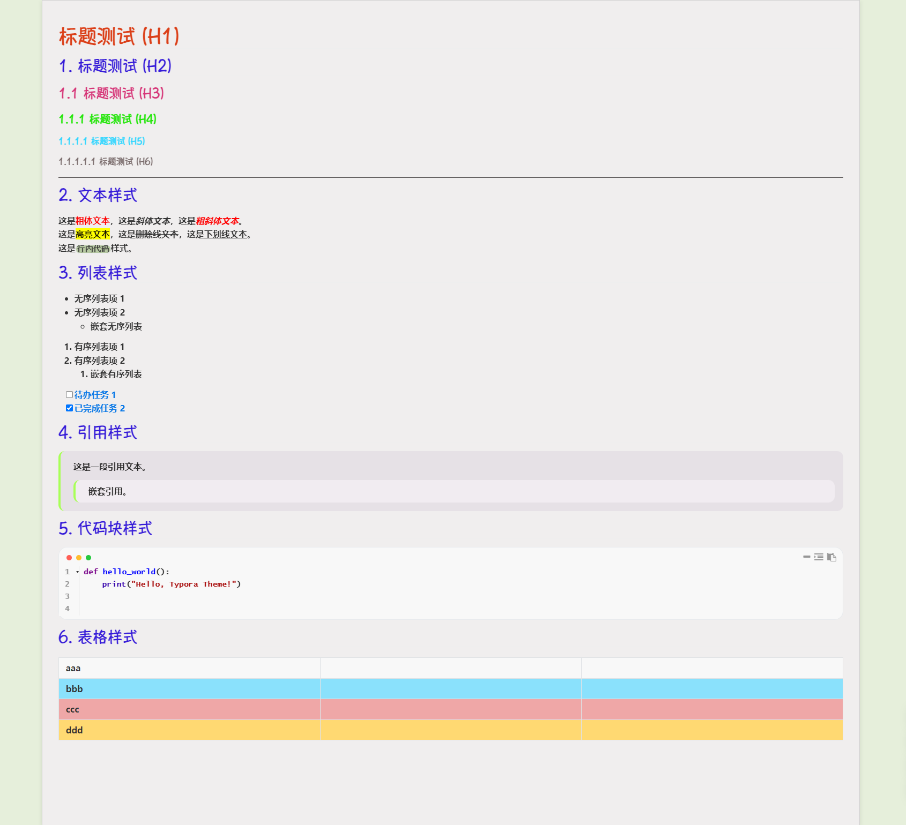

My Typora Theme
一个基于 AI 辅助编写的 Typora 自定义主题，以 `github.css` 为基础文件。

✨ 特性
🏗️ 基础框架：基于 `github.css` 进行二次开发与定制。
🎨 标题风格：标题视觉风格偏向自然手写感。
🔤 正文字体：正文使用“微软雅黑”，端庄大气。
🤖 AI 生成：代码结构由 AI 辅助生成，经过人工调整优化。

📦 安装方法
1. 打开 Typora，点击菜单栏 主题 -> 打开主题文件夹。
2. 将本项目的 css 文件（例如 `github.css`）复制到主题文件夹中。
3. 在 Typora 主题 菜单中选择该主题即可生效。

⚠️ 重要字体版权说明
本主题使用的字体并非免费开源字体，请务必注意版权风险！

涉及字体：华康手札体 W5、华康手札体 W7P
授权情况：商用付费。

📄 许可证
本主题代码（不含字体文件）遵循 MIT 许可证开源。

演示
